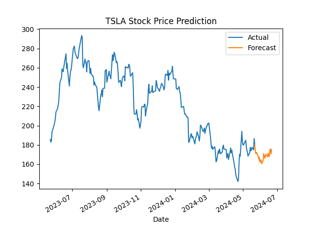

# Tesla-Stock-Price-Predictor
<!DOCTYPE html>
<html lang="en">
<head>
    <meta charset="UTF-8">
    <meta name="viewport" content="width=device-width, initial-scale=1.0"
<body>

This repository contains the code and data for the Stock Price Forecasting project. The goal of this project is to predict future stock prices using various time series forecasting models.

<h2>Repository Structure</h2>

<pre>
Store-Sales---Time-Series-Forecasting
├── data/
│   ├── TSLA.csv
│   ├── TSLA_predictions.csv
│   ├── TSLAprocessed.csv
├── models/
│   ├── TSLA_arima.pkl
│   ├── TSLA_best_lstm.h5
│   ├── TSLA_holt.pkl
│   ├── TSLA_lstm.h5
│   ├── TSLA_prophet.pkl
│   ├── TSLA_ses.pkl
│   ├── TSLA_xgboost.pkl
├── results/
│   ├── plots/
│   ├── prediction/
│       ├── TSLA_predictions.csv
├── Prediction_with_pretrained.ipynb
├── Training_and_Prediction.ipynb
├── LICENSE
└── README.md
</pre>

<h2>Data</h2>

<h3>Input Files</h3>

<h4>TSLA.csv</h4>

    <table>
        <thead>
            <tr>
                <th>Date</th>
                <th>Open</th>
                <th>High</th>
                <th>Low</th>
                <th>Close</th>
                <th>Adj Close</th>
                <th>Volume</th>
            </tr>
        </thead>
        <tbody>
            <tr>
                <td>2010-06-29</td>
                <td>1.266667</td>
                <td>1.666667</td>
                <td>1.169333</td>
                <td>1.592667</td>
                <td>1.592667</td>
                <td>281494500</td>
            </tr>
            <tr>
                <td>2010-06-29</td>
                <td>1.266667</td>
                <td>1.666667</td>
                <td>1.169333</td>
                <td>1.592667</td>
                <td>1.592667</td>
                <td>281494500</td>
            </tr>
            <tr>						
                <td>2010-06-30</td>
                <td>1.719333</td>
                <td>2.028000</td>
                <td>1.553333</td>
                <td>1.588667</td>
                <td>1.588667</td>
                <td>257806500</td>
            </tr>
        </tbody>
    </table>

<h2>Models</h2>

Trained models are stored in the <code>Store-Sales---Time-Series-Forecasting/models/</code> directory.

<ul>
    <li>TSLA_arima.pkl</li>
    <li>TSLA_best_lstm.h5</li>
    <li>TSLA_holt.pkl</li>
    <li>TSLA_lstm.h5</li>
    <li>TSLA_prophet.pkl</li>
    <li>TSLA_ses.pkl</li>
    <li>TSLA_xgboost.pkl</li>
</ul>

<h2>Notebooks</h2>

<ul>
    <li><code>Prediction_with_pretrained.ipynb</code> - Notebook for generating predictions using pre-trained models.</li>
    <li><code>Training_and_Prediction.ipynb</code> - Notebook for training the models and generating predictions.</li>
</ul>

<h2>Results</h2>

<h3>Plots</h3>

Visualizations of the forecasted sales can be found in the <code>Store-Sales---Time-Series-Forecasting/results/plots/</code> directory.

<h3>Predictions</h3>

Generated predictions are stored in the <code>Store-Sales---Time-Series-Forecasting/results/prediction/</code> directory.

<ul>
    <li>TSLA_predictions.csv</li>
</ul>

<h4>TSLA_predictions.csv</h4>

Predictions generated by the trained models.

<b>Note: The stock prices depend on many factors. As more days pass LSTM prediction become highly uncertain but for next day prediction, it is accurate if no exceptions occur. 

    <table>
        <thead>
            <tr>
                <th>Date</th>
                <th>Forecast</th>
            </tr>
        </thead>
        <tbody>
            <tr>
                <td>2024-05-22</td>
                <td>180.11000061035156</td>
            </tr>
            <tr>
                <td>2024-05-23</td>
                <td>173.558837890625</td>
            </tr>
            <tr>
                <td>2024-05-24</td>
                <td>170.9662628173828</td>
            </tr>
            <tr>
                <td>2024-05-27</td>
                <td>169.90623474121094</td>
            </tr>
            <tr>
                <td>2024-05-28</td>
                <td>168.78294372558594</td>
            </tr>
            <tr>
                <td>2024-05-29</td>
                <td>165.57290649414062</td>
            </tr>
            <tr>
                <td>2024-05-30</td>
                <td>167.3539581298828</td>
            </tr>
            <tr>
                <td>2024-05-31</td>
                <td>162.4384307861328</td>
            </tr>
            <tr>
                <td>2024-06-03</td>
                <td>160.5843505859375</td>
            </tr>
            <tr>
                <td>2024-06-04</td>
                <td>161.04034423828125</td>
            </tr>
            <tr>
                <td>2024-06-05</td>
                <td>163.02281188964844</td>
            </tr>
            <tr>
                <td>2024-06-06</td>
                <td>163.525146484375</td>
            </tr>
            <tr>
                <td>2024-06-07</td>
                <td>171.05787658691406</td>
            </tr>
            <tr>
                <td>2024-06-10</td>
                <td>168.14794921875</td>
            </tr>
            <tr>
                <td>2024-06-11</td>
                <td>170.44976806640625</td>
            </tr>
            <tr>
                <td>2024-06-12</td>
                <td>169.00086975097656</td>
            </tr>
            <tr>
                <td>2024-06-13</td>
                <td>168.60597229003906</td>
            </tr>
            <tr>
                <td>2024-06-14</td>
                <td>167.64666748046875</td>
            </tr>
            <tr>
                <td>2024-06-17</td>
                <td>168.0457000732422</td>
            </tr>
            <tr>
                <td>2024-06-18</td>
                <td>174.025390625</td>
            </tr>
            <tr>
                <td>2024-06-19</td>
                <td>175.85574340820312</td>
            </tr>
            <tr>
                <td>2024-06-20</td>
                <td>170.66683959960938</td>
            </tr>
            <tr>
                <td>2024-06-21</td>
                <td>175.00286865234375</td>
            </tr>
        </tbody>
    </table>

</body>
</html>
